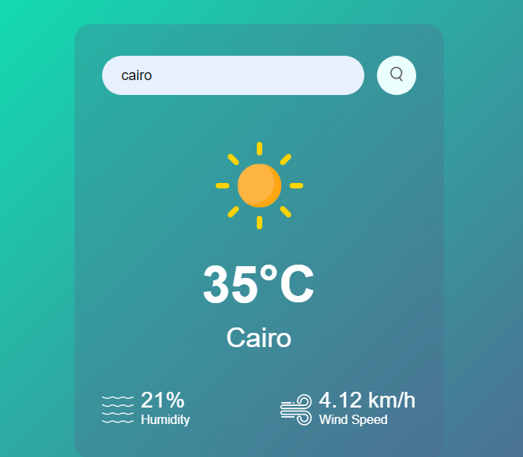

## Web Development

# Weather App

## Introduction

Welcome to the Weather App, a user-friendly and visually appealing application that provides real-time weather information for any city in the world. This project was inspired by a personal quest for an intuitive weather app that offers accurate data with a clean interface.

- **Deployed Site:** [Weather App](https://weather-app-with-api-black.vercel.app/)
- **Final Project Blog Article:** [My Journey Creating a Weather App](https://medium.com/@muhanjiavugwi/my-journey-creating-a-weather-app-trials-learnings-and-accomplishments-40d8f64e93a1)
- **Author LinkedIn:** [Natasha Muhanji](https://www.linkedin.com/in/muhanjinatasha/)

## Installation

To run this project locally, follow these steps:

1. Clone the repository:
   `git clone https://github.com/NatashaMuhanji/weather-app.git`

2. Navigate to the project directory:
   `cd weather-app`

3. Open `index.html` in your preferred web browser;

## Usage
### To use the Weather App:

- Open the app in your web browser.
- Enter the name of the city you want to check the weather for in the search bar.
- Click the "Search" button to retrieve the current weather information.

## Contributing
### Contributions are welcome! If you'd like to contribute to this project, please follow these steps:

- Fork the repository.
- Create a new branch:
```bash
git checkout -b feature/your-feature-name
```
- Make your changes and commit them:
```bash
git commit -m 'Add some feature'
```
- Push to the branch:
```bash
git push origin feature/your-feature-name
```
- Open a pull request.

## Related Projects
I do not have related projects but I am still working on them...

## Licensing
This project is licensed under the MIT License. See the LICENSE file for more details.

## Screenshot

